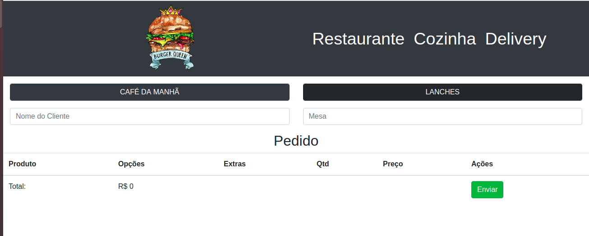
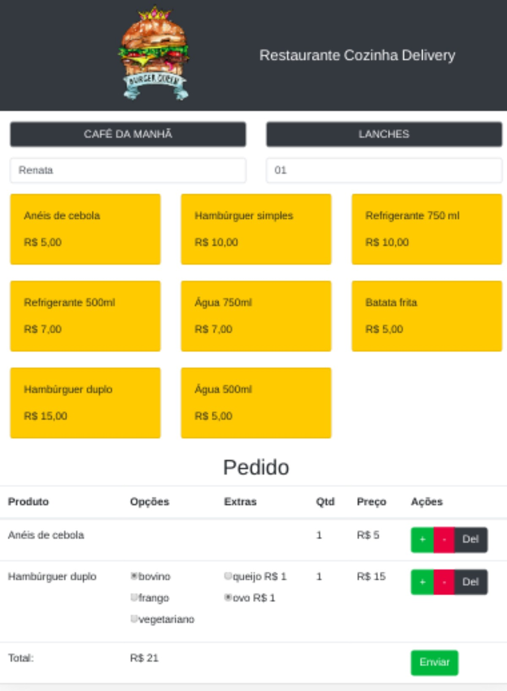
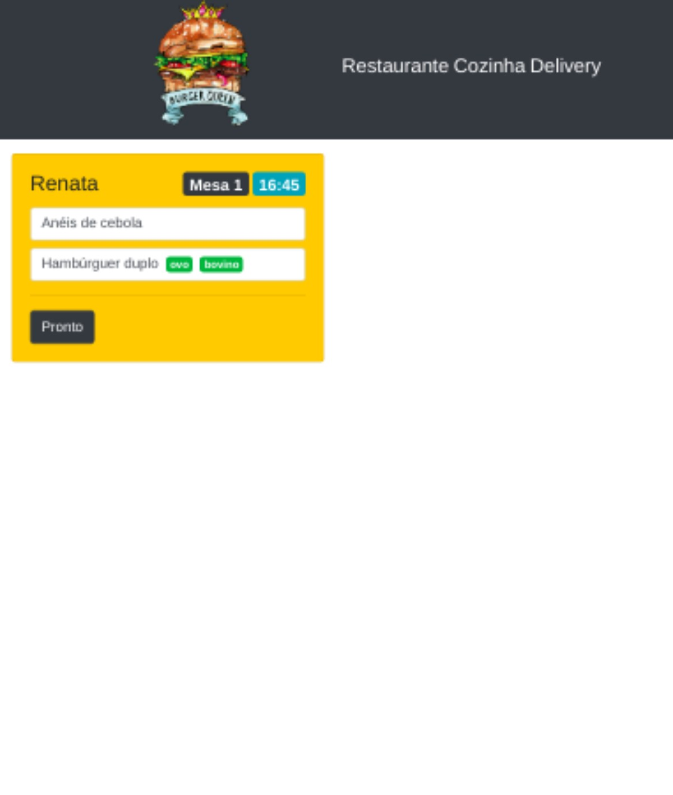
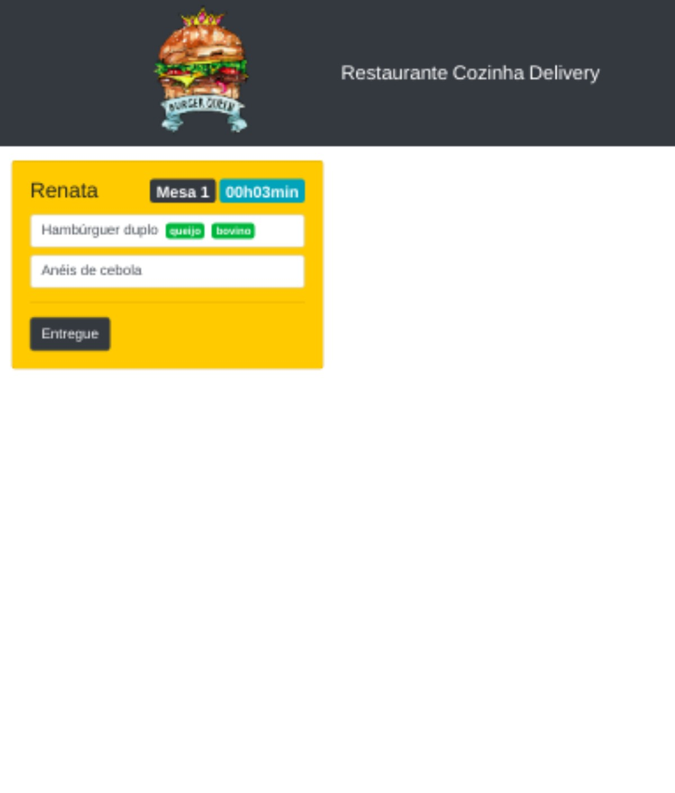

# Burguer Queen

## Resumo:

Uma aplicação de Restaurante fast food 24h que recebe pedidos dos clientes no salão, ao confirmar vai para cozinha e depois retorna para o salão quando pronto.

## Resumo do projeto:

Este projeto foi 100% por demanda. Um pequeno restaurante de hambúrgueres, que está crescendo, necessitou de uma interface em que se possa realizar pedidos utilizando um tablet, e enviá-los para a cozinha para que sejam preparados de forma ordenada e eficiente (através de um backend que os detalhes serão dados mais adiante).

## Objetivos de aprendizagem:

O projeto foi desenvolvido de forma individual, exigiu a construção da aplicação com utilização:

-React Hooks; 
-Firebase;

## Como usar:

A seleção do menu será realizada pelo garçom através dos botões café da manhã ou lanches, ao tocar nos botões o menu é aberto. Para o envio do pedido é necessario o prenchimento do nome e mesa do cliente.

A seleção do pedido é realizada através da escolha dos itens, apresentados no card de cada produto, as quantidades serão ajustadas pelos botões + e -, podendo o pedido ser deletato no botão del. Após a seleção dos itens o pedido é enviado através do botão enviar.

Ao clicar na nav cozinha o usuário poderá visualizar os pedidos em preparação, bem como seu horário de entrada na cozinha, ao clicar no botão pronto o pedido é redirecionado para área de Delivery, sinalizando ao Garçom que o pedido está pronto para ser entregue ao cliente.

Ao clicar no menu delivery o usuário encontrará a lista de pedidos prontos, bem como seu tempo de preparo, sendo assim conta com um botão entregue que apaga esse pedido do banco de dados e o retira da lista do delivery.
 