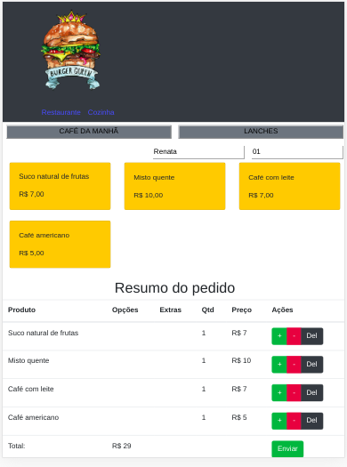
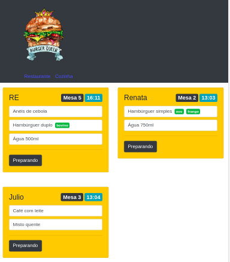

# Burguer Queen

## Resumo:

Uma aplicação de Restaurante fast food 24h que recebe pedidos dos clientes no salão, ao confirmar vai para cozinha e depois retorna para o salão quando pronto.

## Resumo do projeto:

Este projeto foi 100% por demanda. Um pequeno restaurante de hambúrgueres, que está crescendo, necessitou de uma interface em que se possa realizar pedidos utilizando um tablet, e enviá-los para a cozinha para que sejam preparados de forma ordenada e eficiente (através de um backend que os detalhes serão dados mais adiante).

## Objetivos de aprendizagem:

O projeto foi desenvolvido de forma individual, exigiu a construção da aplicação com utilização:

-React Hooks; 
-Firebase;

## Como usar:

A seleção do menu será realizada pelo garçon através dos botões café da manhã ou lanches.
Os itens serão escolhidos através do card de cada produto, as quantidades serão ajustadas pelos botões + e -, podendo o pedido ser deletato no botão del. Após a seleção dos itens o pedido é enviado através do botão enviar.

Ao clicar na nav cozinha o usuário poderá visualizar os pedidos em preparação, bem como seu horário de entrada na cozinha.
